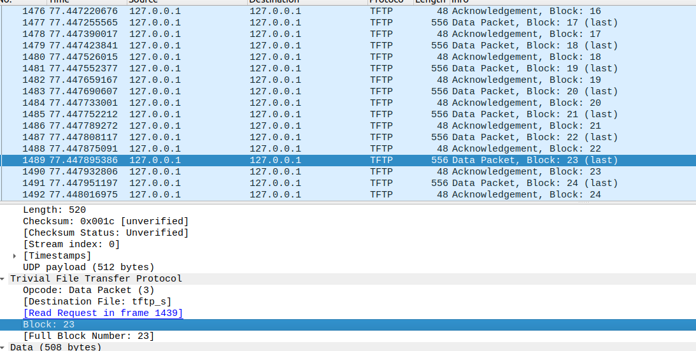

Trivial File Transfer Protocol
=====================================
基于 RFC 1350 的tftp协议简单实现，实现了简单的文件传输功能。


I. Build
---------
Simply run “make”(without quotes)


II. Usage
----------------------------------

**Run TFTP Server**<br>
```
$./tftp_s
```
**Run TFTP Client**<br>
```
$./tftp_c [GET/PUT] [server_address] [file_name]
```
III.Example
----------------------------------



IV. Todo
-------------------

1.超时重传机制
2.没有验证大文件传输
3.传输二进制文件时会有问题
